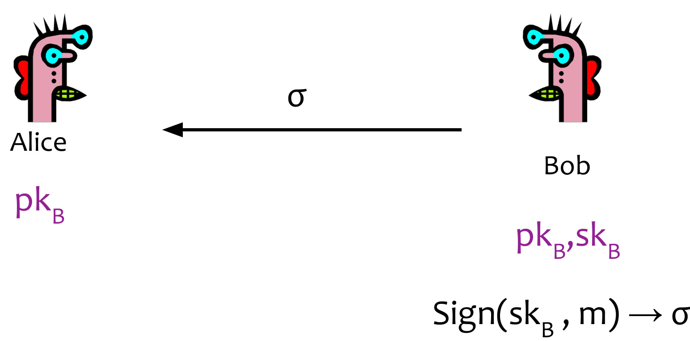
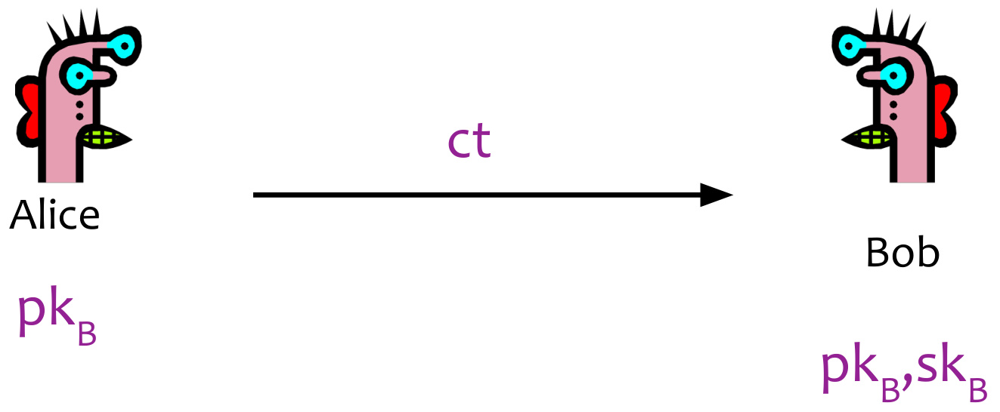

# CSE 484/ CSE M 584: Public Key Encryption + Digital Signatures  

Winter 2025  

Nirvan Tyagi tyagi@cs  

UW Instruction Team: David Kohlbrenner, Yoshi Kohno, Franziska Roesner, and Nirvan Tyagi. Thanks to Dan Boneh, Dieter Gollmann, Dan Halperin, John Manferdelli, John Mitchell, Vitaly Shmatikov, Bennet Yee, Nickolai Zeldovich and many others.  

# Announcements  

Things due Homework 2: Next Wednesday  

# Applications of Public Key Cryptography  

Encryption for confidentiality   
Digital signatures for integrity   
Session key establishment / "Key exchange"  

# Public Key Encryption  

  

# Public Key Encryption  

  

$$
\mathsf { E n c r y p t } ( \mathsf { p k } _ { \mathsf { _ B } } , \mathsf { m } ) \to \mathsf { c t }
$$  

# Public Key Encryption  

  

$\mathsf { E n c r y p t } ( \mathsf { p k } _ { \mathsf { _ B } } , \mathsf { m } ) \to \mathsf { c t }$ $\mathsf { D e c r y p t } ( \mathsf { s k } _ { \mathsf { _ B } } , \mathsf { c t } ) \to \mathsf { m }$  

# Public Key Encryption from Diffie-Hellman  

  

# Public Key Encryption from Diffie-Hellman  

  

Compute DH shared secret:   
K= H(gy)   
Encrypt with authenticated symmetric encryption:   
ctse =SE.Enc(K, m)  

# Public Key Encryption from Diffie-Hellman  

  

# Public Key Encryption from Diffie-Hellman  

  

# Digital Signatures  

No one should be able to forge signatures from Bob's public key without Bob's secret key  

  

# Digital Signatures  

No one should be able to forge signatures from Bob's public key without Bob's secret key  

  

# Digital Signatures  

No one should be able to forge signatures from Bob's public key without Bob's secret key  

  

# Digital Signatures  

No one should be able to forge signatures from. Bob's public key without Bob's secret key  

  

$\mathsf { V e r i f y } ( \mathsf { p k } _ { \mathsf { B } } , \mathsf { m } , \sigma ) \to 0 / 1$ $\mathsf { S i g n } ( \mathsf { s k } _ { \mathsf { s } } , \mathsf { m } ) \to \sigma$  

In-Class Activity 2/5: What benefit do signatures have over MACs?  

Assume prime-order group  

# Schnorr Signature  

Sample one-time key:   
r, g   
Compute random challenge:   
c=H(g',g,m)   
Prove "knowledge" of y:   
z =r+ yc  

  

Alice  

Assume prime-order group  

# Schnorr Signature  

Sample one-time key:   
r, g   
Compute random challenge:   
c =H(g',g,m)   
Prove "knowledge" of y:   
z =r+ yc  

  

Assume prime-order group  

# Schnorr Signature  

Sample one-time key:   
r,g   
Compute random challenge:   
c=H(g',g,m)   
Prove "knowledge" of y:   
z =r+ yc  

$$
\mathsf { \Lambda } \mathsf { c } = \mathsf { H } ( \mathrm { \Lambda } )
$$  

$$
\mathbf { g } ^ { z } = \vec { \mathbf { \nabla } } \mathbf { g } ^ { \mathsf { r } } \oplus ( \mathbf { g } ^ { \mathsf { y } } ) ^ { \mathsf { c } }
$$  

  

# RSA Cryptosystem [Rivest, Shamir, Adleman 1977]  

. Operates over $Z _ { n } ^ { \star }$ for n = pq (product of 2 primes)  

.Background: Helpful number theory facts about Z \* $- \mathrm { O r d e r } = \varphi ( \mathsf { n } ) = ( \mathsf { p } - 1 ) ( \mathsf { q } - 1 )$ . $\varphi ( { \mathfrak { n } } )$ : Euler's Totient Function: # of integers in [1,n) relatively prime to n -Euler's Theorem: $\textsf { F o r e v e r y a } \in \mathsf { Z } _ { \mathsf { n } } ^ { \star } , \mathsf { a } ^ { \varphi ( \mathsf { n } ) } = 1 \left( \mathsf { m o d } \mathsf { n } \right)$  

# RSA Cryptosystem [Rivest, Shamir, Adleman 1977]  

  

# Key generation:  

Generate large primes p, q   
- Compute $n = p 9$ and $\scriptstyle { \varphi ( { \mathsf { n } } ) = ( { \mathsf { p } } - 1 ) ( { \mathsf { q } } - 1 ) }$   
- Choose small e, relatively prime to o(n)   
- Compute modular inverse d: ed = 1 mod $\varphi ( \mathsf { n } )$   
$- \mathrm {  ~ p k _ { \scriptscriptstyle B } = ( e , n ) } ;$  

# RSA Cryptosystem [Rivest, Shamir, Adleman 1977]  

  

# Key generation:  

- Generate large primes p, q   
Compute $n = p 9$ and $\scriptstyle \varphi ( { \mathsf { n } } ) = ( { \mathsf { p } } - 1 ) ( { \mathsf { q } } - 1 )$   
Choose small e, relatively prime to $\varphi ( { \mathsf n } )$   
- Compute modular inverse d: ed = 1 mod $\varphi ( \mathsf { n } )$   
$- \mathrm { \bf ~ p k } _ { \mathrm { \scriptscriptstyle B } } = ( \mathrm { e } , \mathrm { n } ) ;$  

Encryption: ct = me mod n  

Decryption: ctd mod n = (me)d mod n = m  

# Why is RSA Secure?  

.RSA problem: given c, n=pq, and $\mathsf { e }$ such that gcd(e, (n))=1, find m such that $\cdot$ mod n   
. Factoring problem: given positive integer n, find primes $\mathsf { p } _ { 1 } , \ldots , \mathsf { p } _ { \mathsf { k } }$ such that $\mathsf { n } { = } \mathsf { p } _ { 1 } ^ { \ \mathsf { e } _ { 1 } } \mathsf { p } _ { 2 } ^ { \ \mathsf { e } _ { 2 } } { \ldots } \mathsf { p } _ { \mathsf { k } } ^ { \mathsf { \Gamma } }$ %   
If factoring is easy, then RSA problem is easy (knowing factors means you can compute ${ \sf d } =$ inverse of e mod (p-1)(q-1))  

# Why is RSA Secure?  

. RSA problem: given c, n=pq, and $\mathsf { e }$ such that gcd(e, (n))=1, find m such that $\cdot$ mod n  

: Factoring problem: given positive integer n, find primes $\mathsf { p } _ { 1 } , \ldots , \mathsf { p } _ { \mathsf { k } }$ such that $\mathsf { n } { = } \mathsf { p } _ { 1 } ^ { \ \mathsf { e } _ { 1 } } \mathsf { p } _ { 2 } ^ { \ \mathsf { e } _ { 2 } } { \ldots } \mathsf { p } _ { \mathsf { k } } ^ { \mathsf { \Gamma } }$ ek 6  

If factoring is easy, then RSA problem is easy (knowing factors means you can compute ${ \sf d } =$ inverse of e mod (p-1)(q-1))  

Other RSA Caveats  

If m is small, can brute force   
Not randomized!   
Requires n \~ 2048-4096 bits for 128-bits of security   
Largely being phased out for efficient elliptic curve group cryptography  

# What do Quantum Computers mean for Cryptography?  

# What do Quantum Computers mean for Cryptography?  

1. Implications for existing cryptography  

# What do Quantum Computers mean for Cryptography?  

1. Implications for existing cryptography  

.Quantum algorithms exist to solve "hard" assumptions quickly o Shor's algorithm can solve factoring and discrete logarithm "Post-quantum" cryptography o  Build asymmetric cryptography for classical computers based on assumptions that we think are "hard"' even for quantum computers "Lattice-based" cryptography 2. Implications for future cryptography Quantum computing offers new hardness assumptions and new functionality from which to build cryptography  