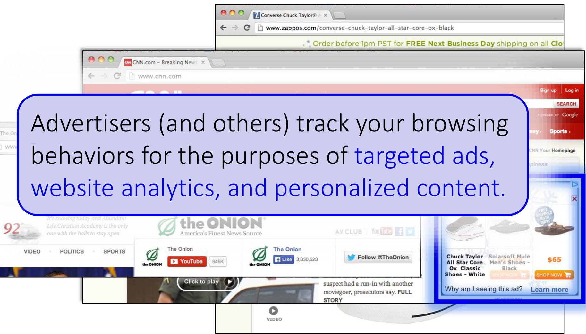

# CSE 484/M584: Computer Security (and Privacy)  

Spring 2025  

# David Kohlbrenner dkohlbre@cs  

UW Instruction Team: David Kohlbrenner, Yoshi Kohno, Franziska Roesner, Nirvan Tyagi. Thanks to Dan Boneh, Dieter Gollmann, Dan Halperin, John Manferdeli, John Mitchell Vitaly Shmatikov, Bennet Yee, and many others for sample slides and materials  

# Admin  

Lab 3 Weblab due next week. Start early, etc etc  

Please double check your Lab 2 gradescope handins . Partner status for code, etc. Remember that you need to make sure there is ONE handin for partners.  

# genai  

. No really, please don't use this.  

# CSRF  

Its just one PosT request, how bad can it be?  

# Why does adding a magic value to the form from bank.com work?. Victim Browser  

  

# Add Secret Token to Forms <input type=hidden value=23a3af01b>  

."Synchronizer Token Pattern'  

Include a secret challenge token as a hidden input in forms  

.Token often based on user's session ID  

Server must verify correctness of token before executing sensitive operations  

: OR add it as an additional cookie, with different permissions (which ones?)  

Why does this work?  

Same-origin policy: attacker can't read token out of legitimate forms loaded in user's browser, so can't create fake forms with correct token  

# CSRF Defenses  

Relevant and useful discussion: https://github.com/golang/go/issues/73626  

. Double-submit magic token in POsT (and the cookie)  

: Origin headers/refer[r]er checking: : Validate what the browser says about the request originating from : Pre-2020, some browsers didn't send on POst(??)  

Cookie restrictions (SameSite) : Tells browser not to send cookies unless starting page is same origin (ish)  

Etc.  

. Honestly, go read filippo's golang discussion, its great.  

# Referer Validation  

# Facebook Login  

For your security, never enter your Facebook password on sites not located on Facebook.com.  

Referer: http://www.facebook.com/home.php  

  

  

Referer: http://www.evil.com/attack.html  

Referer:  

- Lenient referer checking - header is optional : Strict referer checking - header is required  

# Why Not Always Strict Checking?  

. Why might the referer header be suppressed?  

Stripped by the organization's network filter   
. Stripped by the local machine   
Stripped by the browser for HTTPS -> HTTP transitions   
. User preference in browser   
Intentional browser behaviors   
: etc  

# Surprise not-quiz time  

XSS again  

# Reflected xSS  

  

# Stored XSS  

Attack server  

  

# XSRF (aka CSRF)  

Server victim  

  

# Privacy and web tracking  

Aka: so what were all those cookies for anyway?  

# A topic in flux  

Tracking via cookies  

Tracking via other methods  

Fingerprinting  

# Ads That Follow You  

  

# Third-Party Web Tracking  

  

These ads allow criteo.com to link your visits between sites, even if you never click on the ads.  

# Gradescope  

Do you take any particular precautions about tracking?  

For web browsing? Phone apps? Phone tracking?  

. Why do you take or not take those actions? .Any you would like to but don't?  

  

# 2022 Marketing Technology Landscape May2022  

Advertising & Promotion  

# Content &Experience  

# Social & Relationships  

# Commerce &Sales  

# Data Management  

# Display & Programmatic Advertising  

V 0 W \* R 6 0 C 0o EAO D06 o 8 e Cp J 3 8 0 - XIV MORA  

# Mobile Marketing  

M A - W P Na S A M  

# Native/Content Advertising  

2 DCNC Y 4 O O0 6x 7 p O 3 0 0 US pkc an X CN  

# PR  

OOVCNPG A 7 S eR D0 S 0s e O 03 O O-CAN  

# Print  

40C0 Q 0P8 P = ? e   
R 0 C .s LE D KEM ao  

# Search & Social Advertising  

0OCnOGCGOL00Z00 0+GC00CASC0 -bs C A n0s y=be  

# Video Advertising  

DG E 1 AGBSRG C0 O X0  

# Content Marketing  

wGOAP O0OC  

# CMS&Web Experience Management  

c 52 C.  

# DAM&MRM&PIM  

DC A A P   
OGT WOOVDWK COR   
9 LO OMA  

# Email Marketing  

COZVCM OG O e0 S a S 80000 4 6 N = T LZ  

# Interactive Content  

G C 30 BOOL8VOBC :fo C O O w 3   
- a D   
M  

# Marketing Automation & Campaign/Lead Management  

WCOO -   
C  

# Mobile Apps  

300Cm0ns0y000300r0x0-y90PG E000050+80G90G710HG b0  

# Optimization Personalization & Testing  

P YO 6 f O O 2 C 000 A y POQC C P C S0- O  

# SEO  

tps S2 en LW C COOSC AC AO ca B R 6 b  

# Video Marketing  

GGRVCOCOOOV a R0n000 BW OSHOIOSD0 7 Q 6!0 04 SDXW OCCG2OROD 9 H  

# ABM  

OPOCOROOAOSNTOAOD  

# Call Analytics &Management  

t0+00c00V80>0s56r0p00000000 CD 9CO amC -00c000 0  

# Customer Experience Service & Success  

b .0 M A m 26 6MOO < O 6 MeocnU  

# Influencers  

10OH0720R0g00S 2x0050.000+80>00s0000-00000000 A2WT0OAOAN  

# CRM  

O () S D C S - & - 1 6 m C CC A O n N  

# Advocacy Loyalty & Referrals  

e eWB\*O R R m 7 F 0000 . C  

# Community & Reviews  

AO 000000T0000 A esr9ao9cCco 4 14 0G \* RS 5 c C S8 0 0 28 . Q  

# Events, Meetings & Webinars  

DOV C Clf 021 OM ES   
3   
O COO Q O1  

# Social Media Marketing & Monitoring  

RE 5 P @ A  

# Live Chat &Chatbots  

- D 6 5  

# Retail,Proximity &IOT Marketing Analytics Performance & Attribution Agile & Lean Management  

p e CO 1 CWOOM OD N P   
0 P S 3 O 6 S E ee   
REGO P D  

# Affiliate Marketing & Management  

0 .BD QGCAOSOGD Q 0  

Sales Automation Enablement & Intelligenci  

D HD 00 mmOpKO  

# eCommerce Platforms & Carts  

5HO P . CC 3 e 1 SH . S  

# eCommerce Marketing  

Wo QN   
- WOEXSDQO   
F OGES   
C   
6 CA JO0   
O aP  

# Channel Partner & Local Marketing  

C C n A  

Xn SKLNGOCG CCZGAP=O ODOROVRTCCO RAKS x0  

Audience/Marketing Data &Data Enhancement  

Cy 00 se 9 1 X . N0 a2 O OL BAE ON De0G0  

Ipaas Cloud/Data Integration & Tag Management   
P QG   
uw O HDKCO   
S A3E   
e P tP G   
- BC ED   
- 0 0 D   
Business/Customer Intelligence & Data Science   
PROO 2 O me 0 C   
H A FOO   
O Q   
L OA   
a C  

# DMP  

COA tDGoC\*  

# Dashboards &Data Visualization  

SCCOCEOS a. VYGO DW C M. 10   
K\`O e FO  

Governance Compliance And Privacy  

G 6=GgR0O 1n  

# Mobile &Web Analytics  

CyS+G GOCS MOCOOQGODAG es  

# Customer Data Platform  

=CsGtepdC 4 AqnOP x 5 60c  

S000 00006-0500 ge  

# Collaboration  

X  
2CGGX O OTKGZO   
eoec O OOZCJOOO OC 3 6 c0 pe b C 085 Gc@ Dn O M 9   
n09   
24 C  

# Talent Management  

P 000 00 00 H V YO r 16 Q 4 9 m T D 002 TAOCSCGO6 2 . 00 AD P +5 OGOSOKCO 80 80  

# Budgeting &Finance  

O :.r 4p W a3  

# Projects &Workflow  

2O KB 50IE 8Ae wQNa OO0  
a 0 4O c  
902 c 000S  
G i 0sc  
0  

# Product Management  

COcP0 KC MbCCrA  

Vendor Analysis & Management  

PFKOGODSMGNY 00 OGOGOROOMOR GG D  

# 6,521% growth 2011 to 2022  

  
https://chiefmartec.com/2022/05/marketing-technology-landscape-2022-search-9932-solutions-on-martechmap-com/  

# Concerns / About Privacy  

The Washington post Democracy Dies in Darkness  

# House, Senate leaders nearing deal on landmark online privacy bill  

The expected agreement vaults Congress closer to legislation that lawmakers have sought for decades  

# By Cristiano Lima-Strong  

April 5, 2024 at 7:26 p.m. EDT  

The file consist. identifies her aq  

Un Friday, two bius were ntroduced n wasnngton n support or a vo Not Track mechanism that would give users control over how much of their data was collected by advertisers and other online companies.  

By JENNIFER VALENTINO-DEVRIES, JEREMY SINGER-VINE and ASHKAN SOLTANI December 24, 2012  

# First and Third Parties  

- First-party cookie: belongs to top-level domain.  

. Third-party cookie: belongs to domain of embedded content (such as image, iframe).  

  

# Anonymous Tracking  

Trackers included in other sites use third-party cookies containing unique identifiers to create browsing profiles.  

  

# Basic Tracking Mechanisms  

. Tracking requires: (1) re-identifying a user. (2) communicating id $+$ visited site back to tracker.  

Hypertext Transfer Protocol GET /pixel/p-3aud4J6uA4Z6Y.gif?labels=InvisibleBox&busty=2710 HTTP/1.1\r\n Host: pixel.quantserve.com\r\n Connection: keep-alive\r\n Accept: image/webp,\*/\*:q=0.8\r\n User-Agent: Mozilla/5.0 (Macintosh; Intel Mac 0S X 10_9_2) AppleWebKit/537.36 Referer: http://www. theonion.com/\r\n Accept-Encoding: gzip, deflate,sdch\r\n Accept-Language: en-Us,en;q=0.8\r\n Cookie:mc=52a65386-f1de1-00ade-0b26e;d=ENkBRgGHD4GYEA35MMIL74MKiyDs1A2MQI1Q  

# Tracking Technologies  

HTTP Cookies HTTP Auth HTTP Etags   
Content cache   
IE userData HTML5 protocol and conten handlers HTML5 storage   
Flash cookies   
Silverlight storage   
TLS session ID & resume   
Browsing history   
window.name   
HTTP STS   
DNS cache  

"'Zombie" cookies that respawn (http://samy.pl/evercookie)  

# Other Trackers?  

  
"Personal" Trackers  

  

# Personal Tracking  

  

.Tracking is not anonymous (linked to accounts).   
Users directly visit tracker's site > evades some defenses.  

# 1996-2016: More & More Tracking . More trackers of more types, more per site, more coverage  

  

# Defenses to Reduce Tracking  

Do Not Track?  

Send a 'Do Not Track' request with your browsing traffic  

Do Not Track is not a technical defense: trackers must honor the request.  

# Defenses to Reduce Tracking  

Do Not Track proposal?  

Private browsing mode?  

Private browsing mode doesn't protect against network attackers fully.  

# You've gone incognito  

Now you can browse privately, and other people who use this device won't see your activity. However, downloads and bookmarks will be saved. Learn more  

Chrome won't save the following information:  

Your activity might still be visible to:  

Your browsing history Cookies and site data Information entered in forms  

Websites you visit Your employer or school Your internet service provider  

# Defenses to Reduce Tracking  

Do Not Track proposal? Private browsing mode? .Third-party cookie blocking?  

  

# 3rd party cookies  

Chrome...  

'By undermining the business model of many ad-supported websites, blunt approaches to cookies encourage the use of opaque techniques such as fingerprinting (an invasive workaround to replace cookies), which can actually reduce user privacy and control. We believe that we as a community can, and must, do better."  

Aug 2022: Remove $3 ^ { \mathsf { r d } }$ party cookies by 2024  

# The state of 3rd party cookies  

Safari:  

: Blocks most - https://webkit.org/blog/10218/full-third-party-cookie-blockingand-more/  

Chrome  

: No longer removing. https://privacysandbox.com/news/privacy-sandboxnext-steps/  

Firefox : Specific blocks/etc https://developer.mozilla.org/en-US/blog/goodbye-thirdparty-cookies/  

. Others . Variety of behaviors, wide variation  

# Cookie ghostwriting  

: No 3rd party cookies allowed  

Instead, <script src=https://trackerdomain/cookiewriter.js/>  

. No lIonger in an iframe... what can they do?  

# Fingerprinting  

An alternative, popular, approach is fingerprinting  

: Website runs some javascript to measure browser/machine behavior Generates an ID from this : ID is semi-consistent even across things like incognito mode  

. Fingerprinting is unaffected by $3 ^ { \mathsf { r d } }$ party cookie changes!  