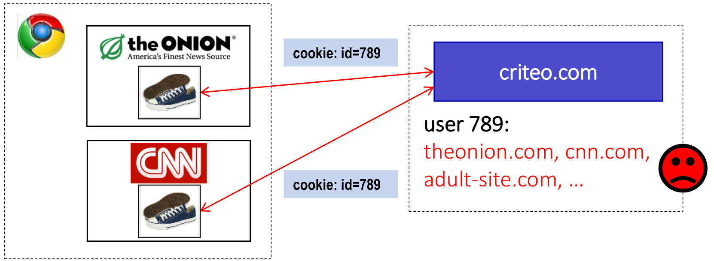
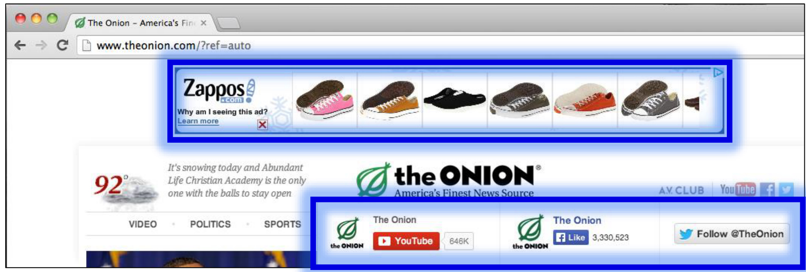
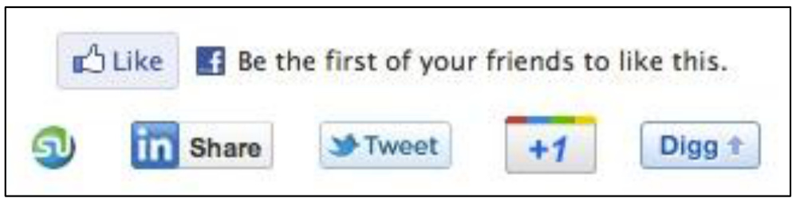
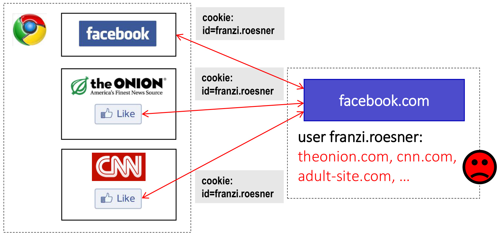
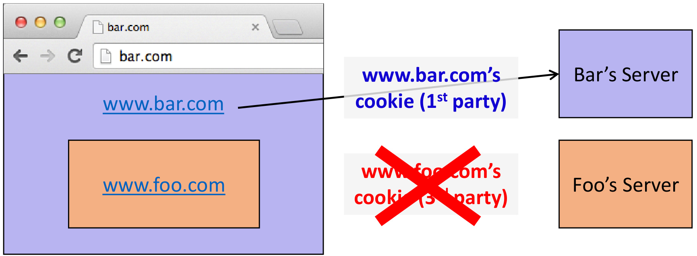
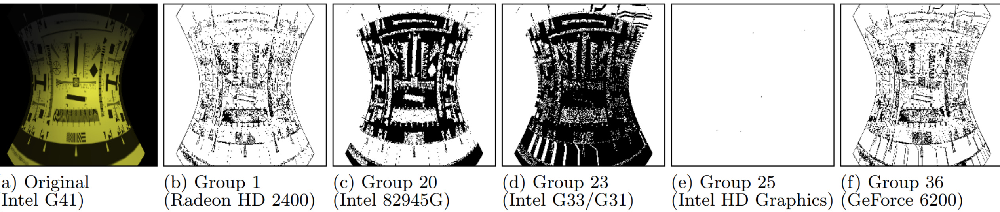

# CSE 484/M584: Computer Security (and Privacy)  

Spring 2025  

# David Kohlbrenner dkohlbre@cs  

UW Instruction Team: David Kohlbrenner, Yoshi Kohno, Franziska Roesner, Nirvan Tyagi. Thanks to Dan Boneh, Dieter Gollmann, Dan Halperin, John Manferdeli, John Mitchell Vitaly Shmatikov, Bennet Yee, and many others for sample slides and materials  

# Admin  

. Lab 3 weblab due next week. Start early, etc etc  

# Anonymous Tracking  

Trackers included in other sites use third-party cookies containing unique identifiers to create browsing profiles.  

  

# Basic Tracking Mechanisms  

. Tracking requires: (1) re-identifying a user. (2) communicating id $+$ visited site back to tracker.  

Hypertext Transfer Protocol GET /pixel/p-3aud4J6uA4Z6Y.gif?labels=InvisibleBox&busty=2710 HTTP/1.1\r\n Host: pixel.quantserve.com\r\n Connection: keep-alive\r\n Accept: image/webp,\*/\*;q=0.8\r\n User-Agent: Mozilla/5.0 (Macintosh; Intel Mac 0S X 10_9_2) AppleWebKit/537.36 Referer: http://www.theonion.com/\r\n Accept-Encoding: gzip, deflate,sdch\r\n Accept-Language: en-Us,en;q=0.8\r\n Cookie:mc=52a65386-f1de1-00ade-0b26e;d=ENkBRgGHD4GYEA35MMIL74MKiyDs1A2MQI1Q  

# Tracking Technologies  

HTTP Cookies HTTP Auth HTTP Etags   
Content cache   
IE userData HTML5 protocol and conten handlers HTML5 storage   
Flash cookies   
Silverlight storage   
TLS session ID & resume   
Browsing history   
window.name   
HTTP STS   
DNS cache  

"'Zombie" cookies that respawn (http://samy.pl/evercookie  

# Other Trackers?  

  
"Personal" Trackers  

  

# Personal Tracking  

  

.Tracking is not anonymous (linked to accounts).   
Users directly visit tracker's site > evades some defenses.  

# Defenses to Reduce Tracking  

Do Not Track?  

Send a 'Do Not Track' request with your browsing traffic  

Do Not Track is not a technical defense: trackers must honor the request.  

# Defenses to Reduce Tracking  

Do Not Track proposal?  

Private browsing mode?  

Private browsing mode doesn't protect against network attackers fully.  

# You've gone incognito  

Now you can browse privately, and other people who use this device won't see your activity. However, downloads and bookmarks will be saved. Learn more  

Chrome won't save the following information:  

Your activity might still be visible to:  

Your browsing history Cookies and site data Information entered in forms  

Websites you visit Your employer or school Your internet service provider  

# Defenses to Reduce Tracking  

Do Not Track proposal? Private browsing mode? .Third-party cookie blocking?  

  

# 3rd party cookies  

Chrome...  

"By undermining the business model of many ad-supported websites, blunt approaches to cookies encourage the use of opaque techniques such as fingerprinting (an invasive workaround to replace cookies), which can actually reduce user privacy and control. We believe that we as a community can, and must, do better."  

Aug 2022: Remove $3 ^ { \mathsf { r d } }$ party cookies by 2024  

# The state of 3rd party cookies  

Safari:  

: Blocks most - https://webkit.org/blog/10218/full-third-party-cookie-blockingand-more/  

Chrome  

: No longer removing. https://privacysandbox.com/news/privacy-sandboxnext-steps/  

Firefox : Specific blocks/etc https://developer.mozilla.org/en-US/blog/goodbye-thirdparty-cookies/  

. Others . Variety of behaviors, wide variation  

# Fingerprinting  

An alternative, popular, approach is fingerprinting : Website runs some javascript to measure browser/machine behavior Generates an ID from this : ID is semi-consistent even across things like incognito mode  

. Fingerprinting is unaffected by $3 ^ { \mathsf { r d } }$ party cookie changes!  

Gradescope: Fingerprint the browser!  

Your (ad company) goal is to track users whenever they load your <iframe>   
. They don't have $3 ^ { \mathsf { r d } }$ party cookies   
. So you will measure their browser instead from JS.   
. What might be a good thing to measure?  

# Fingerprinting  

. The user agent string from each browser   
The HTTP ACCEPT headers sent by the browser   
Screen resolution and color depth   
The Timezone your system is set to   
. The browser extensions/plugins, like Quicktime, Flash, Java or Acrobat, that are installed in the browser, and the versions of those plugins   
. The fonts installed on the computer, as reported by Flash or Java.   
Whether your browser executes JavaScript scripts  

# Fingerprinting  

. Yes/no information saying whether the browser accepts various kinds of cookies and "super cookies"  

. A hash of the image generated by canvas fingerprinting   
. A hash of the image generated by WebGL fingerprinting   
. Yes/no whether your browser is sending the Do Not Track header   
Your system platform (e.g. Win32, Linux x86)   
. Your system language (e.g. en-US)   
Your browser's touchscreen support  

# Fingerprinting  

: Yes/no information saying whether the browser accepts various kinds of cookies and "super cookies"  

. A hash of the image generated by canvas fingerprinting  

. A hash of the image generated by WebGL fingerprinting  

Yes/no whether your browser is sending the Do Not Track header.  

: Your system platform (e.g. Win32, Linux x86)  

Your system language (e.g. en-US)  

. Your browser's touchscreen support  

# WebGL and Canvas Fingerprinting  

Every combination of OS, drivers, GPU, etc renders things slightly differently.   
. This is deterministic.  

  
Figure 10: Original render and difference maps for Group 24  

WebGL an  

Every combina differently. This is determi  

Windows:   

<html><body><table><tr><td>How quickly daft jumping zebras vex. (Also, pur</td><td rowspan="8">ngs slightly</td></tr><tr><td>How quickly daft jumping zebras vex. (Also, pur.</td></tr><tr><td>How quickly daft jumping zebras vex. (Also, pur</td></tr><tr><td>How quickly daft jumping zebras vex. (Also, pur.</td></tr><tr><td>How quickly daft jumping zebras vex. (Also, pu</td></tr><tr><td>OS X:</td></tr><tr><td>How quickly daft jumping zebras vex. (Also, pu</td></tr><tr><td>How quickly daft jumping zebras vex. (Also, pu</td></tr><tr><td>How quickly daft jumping zebras vex. (Also, pu</td></tr><tr><td>How quickly daft jumping zebras vex. (Also, pu</td><td rowspan="2"></td></tr><tr><td>Linux: How quickly daft jumping zebras vex. (Also, pu</td></tr><tr><td></td><td rowspan="2"></td></tr><tr><td rowspan="2">How quickly daft jumping zebras vex. (Also, pur How quickly daft jumping zebras vex. (Also, p.</td></tr><tr><td></td></tr></table></body></html>  

# Cookie ghostwriting  

: No 3rd party cookies allowed  

Instead, <script src=https://trackerdomain/cookiewriter.js/>  

. No lIonger in an iframe... what can they do?  