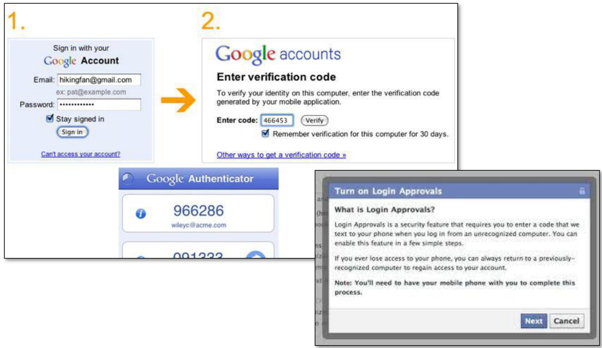

# CSE 484/M584: Computer Security (and Privacy)  

Spring 2025  

# David Kohlbrenner dkohlbre@cs  

UW Instruction Team: David Kohlbrenner, Yoshi Kohno, Franziska Roesner, Nirvan Tyagi. Thanks to Dan Boneh, Dieter Gollmann, Dan Halperin, John Manferdeli, John Mitchell Vitaly Shmatikov, Bennet Yee, and many others for sample slides and materials  

# Admin  

Lab 3 Weblab due Wednesday  

When helping other students on Ed, make sure you are helping them get unstuck or think about the problem differently, not posting an answer.  

# Authentication  

# Basic Problem  

  

How do you prove to someone that you are who you claim to be?  

Any system with access control must solve this problem.  

# A slightly more fundamental question  

. What are we trying to prove?  

# Many Ways to Prove Who You Are  

"Something you know" Passwords Answers to questions that only you know  

"Something you have' Secure tokens, mobile devices  

"Something you are' Biometrics  

# Passwords are a classic attack vector  

: 2025: 80% of basic Web Application attacks used stolen creds : 56% used brute forcing of weak creds   
: 2025: \~15% of network instrusions used some sort of stolen/weak credentials : In 2022, was 50%!  

Source: Verizon Data Breach Investigations Report https://www.verizon.com/business/resources/reports/dbir/#archive Lots of interesting data here.  

# Passwords are a classic attack vector  

: First step after any successful intrusion: search for credentials : Install keyloggers/etc to capture more.  

: Second step: run cracking tools on password files . Cracking needed because modern systems usually do not store passwords in the clear  

# UNIX-Style Passwords  

. How should we store passwords on a server?  

In cleartext?  

Encrypted?  

Hashed?  

  

Gradescope!  

. What is a benefit of storing passwords encrypted?  

. What is a benefit of storing passwords hashed?  

# Password Hashing  

Instead of user password, store H(password)  

. When user enters password, compute its hash and compare with entry in password file  

. System does not store actual passwords! . System itself can't easily go from hash to password Which would be possible if the passwords were encrypted  

. Hash function H must have some properties : One-way: given H(password), hard to find password - No known algorithm better than trial and error  

"Slow" to compute  

# UNIX Password System  

Approach: Hash passwords  

: Problem: passwords are not truly random  

With 52 upper- and lower-case letters, 10 digits and 32 punctuation symbols, there are 948 == 6 quadrillion possible 8-character passwords (\~252)  

BUT: Humans like to use dictionary words, human and pet names == 1 million common passwords  

# Dictionary Attack  

: Dictionary attack is possible because many passwords come from a small dictionary  

Attacker can pre-compute H(word) for every word in the dictionary - this only needs to be done once!  

.This is an offline attack .Once password file is obtained, cracking is instantaneous  

Sophisticated password guessing tools are available  

Take into account freq. of letters, password patterns, etc.  

# Salt  

username:fURxfg 4hLBX:14510:30:User Name:/u/username:/bin/sh  

  

Users with the same password have different entries in the password file Offline dictionary attack becomes much harder  

# Advantages of Salting  

: Without salt, attacker can pre-compute hashes of all dictionary words once for all password entries  

Same hash function on all UNiX machines   
Identical passwords hash to identical values; one table of hash values can be used for all password files  

. With salt, attacker must compute hashes of all dictionary words once for each password entry  

. With 12-bit random salt, same password can hash to $\cdot$ different hash values . Attacker must try all dictionary words for each salt value in the password file  

Pepper: Secret salt (not stored in password file)  

# Other Password Security Risks  

. Keystroke loggers . Hardware : Software (spyware)   
. Shoulder surfing   
: Same password at multiple sites   
Broken implementations .E.g. TENEX timing attack   
: Social engineering  

  

# Other Issues  

: Usability .Hard-to-remember passwords? Carry a physical object all the time?   
. Denial of service . Attacker tries to authenticate as you, account locked after three failures  

# Default Passwords  

. Examples from Mitnick's "Art of Intrusion"  

.U.S. District Courthouse server: "public" / "public"  

- NY Times employee database: pwd $\mathbf { \sigma } = \mathbf { \sigma }$ last 4 SSN digits  

Mirai IoT botnet  

. Weak and default passwords on routers and other devices  

# Weak Passwords  

rockyou TM . RockYou hack ."Social gaming" company : Database with 32 million user passwords from partner social networks . Passwords stored in the clear : December 2009: entire database hacked using an SQL injection attack and posted on the Internet One of many such examples!  

# Weak Passwords  

RockYou hack  

# Password Popularity - Top 20  

# rockyou"  

" D P D p  

<html><body><table><tr><td>Rank</td><td>Password</td><td>Number of Users with Password (absolute)</td></tr><tr><td>1</td><td>123456</td><td>290731</td></tr><tr><td>2</td><td>12345</td><td>79078</td></tr><tr><td>3</td><td>123456789</td><td>76790</td></tr><tr><td>4</td><td>Password</td><td>61958</td></tr><tr><td>5</td><td>iloveyou</td><td>51622</td></tr><tr><td>6</td><td>princess</td><td>35231</td></tr><tr><td>7</td><td>rockyou</td><td>22588</td></tr><tr><td>8</td><td>1234567</td><td>21726</td></tr><tr><td>9</td><td>12345678</td><td>20553</td></tr><tr><td>10</td><td>abc123</td><td>17542</td></tr></table></body></html>  

<html><body><table><tr><td>Rank</td><td>Password</td><td>Number of Users with Password (absolute)</td></tr><tr><td>11</td><td>Nicole</td><td>17168</td></tr><tr><td>12</td><td>Daniel</td><td>16409</td></tr><tr><td>13</td><td>babygir!</td><td>16094</td></tr><tr><td>14</td><td> monkey</td><td>15294</td></tr><tr><td>15</td><td> Jessica</td><td>15162</td></tr><tr><td>16</td><td>Lovely</td><td>14950</td></tr><tr><td>17</td><td> michael</td><td>14898</td></tr><tr><td>18</td><td>Ashley</td><td>14329</td></tr><tr><td>19</td><td>654321</td><td>13984</td></tr><tr><td>20</td><td>Qwerty</td><td>13856</td></tr></table></body></html>  

# Aside: Ethics of studying password breaches  

Is there a risk to using stolen password databases?   
. Who might this hurt?   
Is the payoff worth it?  

[Inglesant and Sasse, "The True Cost of Unusable Password Policies"]  

# Password Policies  

Old recommendation:  

7 or 8 characters, at least 3 out of {digits, upper-case, lower-case, nonalphanumeric}, no dictionary words, change every 4 months, password may not be similar to previous 12 passwords..  

# Password Policies  

Old recommendation:  

7 or 8 characters, at least 3 out of {digits, upper-case, lower-case, nonalphanumeric}, no dictionary words, change every 4 months, password may not be similar to previous 12 passwords..  

. But ... results in frustrated users and less security  

Burdens of devising, learning, forgetting passwords  

.Users construct passwords insecurely, write them down  

. Can't use their favorite password construction techniques (small changes to old passwords, etc.)  

Heavy password re-use across systems (Password managers can help)  

# "New" (2017) NIST Guidelines  

Remove requirement to periodically change passwords : Screen for commonly used passwords   
: Allow copy-paste into password fields   
: But concern: what apps have access to clipboard?   
. Allow but don't require arbitrary special characters Etc.  

https://pages.nist.gov/800-63-3/sp800-63b.html  

# Improving(?) Passwords  

. Add biometrics . For example, keystroke dynamics or voiceprint  

. Graphical passwords Goal: easier to remember? no need to write down?  

Password managers .Examples: LastPass, KeePass, built into browsers Can have security vulnerabilities..  

Two-factor authentication Leverage phone (or other device) for authentication  

# Password managers  

. Generation Secure generation of random passwords   
Management . Allows for password-per-account   
. Safety? . Single point of failure Vulnerability? .Phishing?  

# Multi-Factor Authentication  

  

# Secondary Factors Do Help!  

# Account takeover prevention rates, by challenge type  

  
Device-based challenges   
Knowledge-based challenges   
Both device- and knowledge-based challenges help thwart automated bots, while device-based challenges help   
thwart phishing and even targeted attacks  

# Why does hardware 2FA work?  

. We need to stop the user who believe they are logging in from letting the attacker in.  

Consider:  

User goes to attacker[.]com/googlelogin.php   
User tries to log in   
.How will SMS codes stop the attacker?   
.How will a token that understands origins stop the attacker?  

# Hardware 2FA tokens (U2F/FIDO)  

  

# Graphical Passwords  

. Many variants... one example: Passfaces . Assumption: easy to recall faces  

  

# Graphical Passwords  

Another variant: draw on the image (Windows 8)  

  

Problem: users choose predictable points/lines  

# Unlock Patterns  

  

# Problems:  

Predictable patterns (familiar pattern by now)   
Smear patterns   
Side channels: apps can use accelerometer and gyroscope to extract pattern!  

# What About Biometrics?  

. Authentication: What you are  

. Unique identifying characteristics to authenticate user or create credentials  

Biological and physiological: Fingerprints, iris scan  

Behaviors characteristics - how perform actions: Handwriting, typing, gait  

# Advantages:  

Nothing to remember  

.Passive  

Can't share (generally)  

.With perfect accuracy, could be fairly unique  

What are reasons to use/not use biometrics?  

# Issues with Biometrics  

Private, but not secret  

Maybe encoded on the back of an ID card?  

.Maybe encoded on your glass, door handle, ...  

Sharing between multiple systems?  

. Revocation is difficult (impossible?) . Sorry, your iris has been compromised, please create a new one...  

. Physically identifying . Soda machine to cross-reference fingerprint with DMV?  

Birthday paradox . With false accept rate of 1 in a million, probability of false match is above 50% with only 1609 samples  

# US Law and Biometrics  

: Circuit splits on what 5th amendment covers.  

: Broadly: some biometrics (e.g. face unlock) may not be protected : Some biometrics (e.g. fingerprint) might be protected  

Passcodes are protected  

# Attacking Biometrics  

: An adversary might try to steal biometric info . Malicious fingerprint reader Consider when biometric is used to derive a cryptographic key . Residual fingerprint on a glass  

TouchID  

  

# Security. Right at your fingertip.  

Your fingerprint is the perfect password.You always have it with you.And no one can ever guess what it is.Our breakthrough Touch ID technology uses a unique fingerprint identity sensor to make unlocking your phone easy and secure.And with new developments in iOS 8 and Touch ID,your fingerprint will grant you faster access to so much more.  

# Passkeys (2024ish)  

: An actual, deployed, genuine password replacement . Also a 2fa replacement! . And a username replacement!  

Basic goals:  

: Store some sort of key on user end-devices   
Use that key to login to Stuff   
Don't allow losing the key   
: Somehow make the key moving between devices Easy  